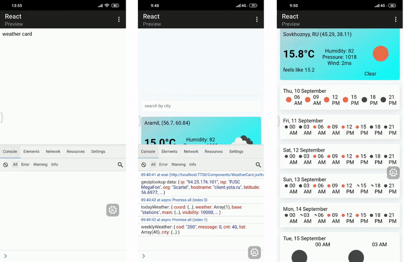

# Mobile-only coding challenge
Inspired by [Joma Tech «Coding a whole web app ONLY using my Phone»](https://www.youtube.com/watch?v=0KmUoTfGa34) (but only the client side)

## Demo
Available [on this link](https://justmonk.github.io/only-mobile-coding-challenge/)

## Process

## Tools
- React 16.8+
- Android device
- [Spck Editor](https://play.google.com/store/apps/details?id=io.spck) app
